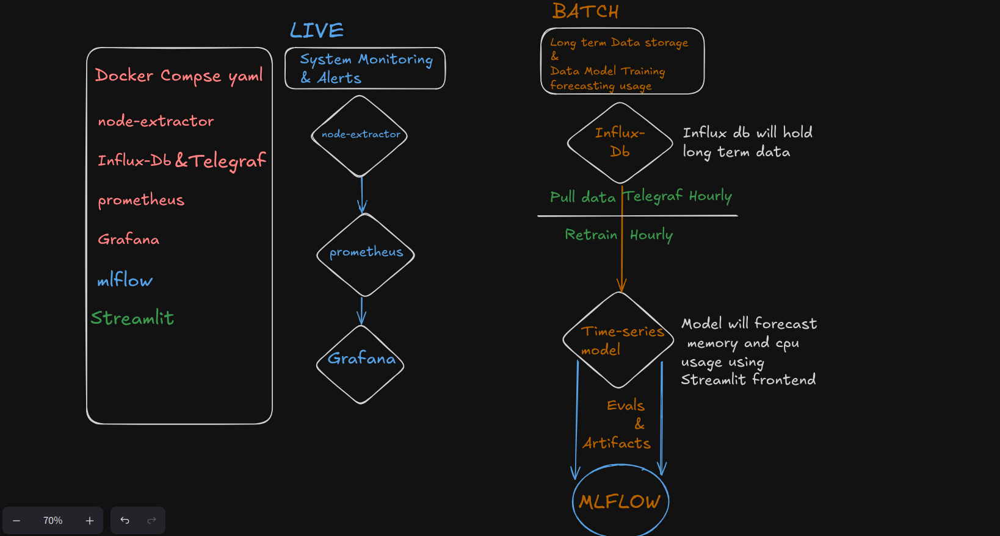
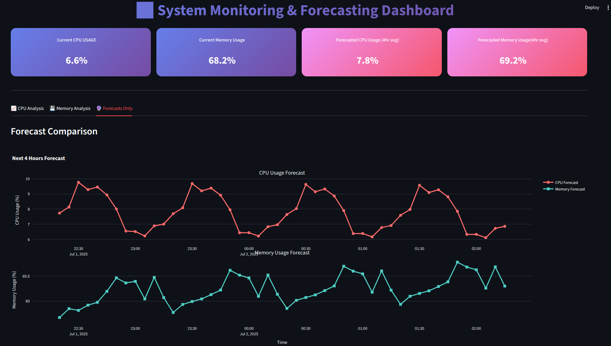

# Time-Series Forecasting for System Monitoring

<!-- Hero Image Placeholder - Add your project screenshot/diagram here -->
<div align="center">
  
</div>

---

> 📝 **Read the detailed blog post**: [Building a Real-Time Server Monitoring System with AI-Powered Forecasting](https://medium.com/@akashanandani.56/building-a-real-time-server-monitoring-system-with-ai-powered-forecasting-af0ce53b5510)

## 🎯 Project Overview

**A complete real-time server monitoring and forecasting system** that combines modern DevOps tools with machine learning to predict system resource usage. This project demonstrates end-to-end MLOps practices with automated data collection, preprocessing, model training, and interactive visualization.

### 🔍 What This Project Does

- **📊 Real-time Monitoring**: Continuously collects CPU and memory metrics from Linux servers
- **🤖 ML Forecasting**: Uses SARIMA models to predict system resource usage 4 hours into the future
- **📈 Interactive Dashboards**: Beautiful Streamlit UI for forecast visualization and Grafana for real-time monitoring
- **🔬 Experiment Tracking**: MLflow integration for model versioning and performance tracking
- **🐳 Containerized Deployment**: Complete Docker stack with 7 integrated services

### 🎪 Tech Stack


---

## 🚀 Quick Start

> **📋 Prerequisites**: Linux/macOS, Docker, Python 3.8+

### ⚡ 3-Step Setup

```bash
# 1. Setup directories (IMPORTANT - prevents permission errors!)
./setup-directories.sh

# 2. Start all services
docker-compose up -d

# 3. Run the complete ML pipeline
python src/main.py
```

### 🌐 Access Your Dashboards

  

Once running, visit these URLs:

| 🎯 **Main Dashboard** | 📈 **Monitoring** | 🔬 **ML Tracking** |
|:---:|:---:|:---:|
| [Streamlit UI](http://localhost:8501) | [Grafana](http://localhost:3000) | [MLflow](http://localhost:5000) |
| Interactive Forecasts | Real-time Metrics | Experiment Tracking |

> 📖 **For detailed setup instructions, see [SETUP.md](SETUP.md)**

---

## 🏗️ System Architecture


### 🔄 Service Stack

| **Layer** | **Service** | **Purpose** | **Port** |
|-----------|-------------|-------------|----------|
| **📊 Visualization** | Streamlit | Interactive ML Dashboard | 8501 |
| **📈 Monitoring** | Grafana | Real-time System Dashboards | 3000 |
| **🔬 ML Ops** | MLflow | Experiment Tracking & Model Registry | 5000 |
| **💾 Storage** | InfluxDB | Time-series Database (ML Training) | 8086 |
| **📊 Metrics** | Prometheus | Metrics Collection & Querying | 9090 |
| **🔧 Collection** | Telegraf | Data Ingestion Agent | - |
| **📡 Exporter** | Node Exporter | System Metrics Endpoint | 9100 |

---

## 🤖 Machine Learning Pipeline

### 📈 SARIMA Forecasting

Our ML pipeline uses **Seasonal ARIMA (SARIMA)** models optimized for system metrics:

- **🎯 Target Metrics**: CPU & Memory usage percentages
- **⏰ Forecast Horizon**: Next 4 hours (48 steps at 5-minute intervals)
- **🔄 Seasonality**: 1-hour cycles (12 periods × 5 minutes)
- **📊 Model Selection**: Automated parameter optimization with AIC scoring

### 🔄 Pipeline Flow


```bash
Linux System → Node Exporter → Prometheus (15s intervals) → Grafana Dashboards -> Telegraf -> InfluxDB 
```

### 📁 Pipeline Components

| **Script** | **Function** | **Output** |
|------------|--------------|------------|
| `src/main.py` | 🚀 **Pipeline Orchestrator** | Runs complete workflow |
| `src/ingestion.py` | 📥 **Data Collection** | Raw metrics from InfluxDB |
| `src/pre_processing.py` | 🧹 **Data Cleaning** | Preprocessed time series |
| `src/model_train.py` | 🤖 **Model Training** | SARIMA models + forecasts |
| `src/model_inference.py` | 🔮 **Predictions** | Latest model predictions |

---

## ✨ Key Features

### 🎨 Interactive Streamlit Dashboard

- **📊 Real-time Metrics**: Current CPU/Memory usage with beautiful gradient cards
- **📈 Forecast Charts**: Interactive Plotly visualizations with historical vs predicted data
- **🔮 4-Hour Predictions**: Average forecast values across the prediction horizon
- **📱 Responsive Design**: Modern UI with tabbed interface for different analyses

### 📊 Monitoring & Alerting

- **🔍 Grafana Dashboards**: Pre-configured system monitoring with Node Exporter metrics
- **⚡ Real-time Updates**: 15-second metric collection intervals
- **📈 Historical Analysis**: Long-term trend analysis and pattern recognition

### 🔬 MLOps Integration

- **📝 Experiment Tracking**: MLflow logging of model parameters, metrics, and artifacts
- **🏷️ Model Versioning**: Automatic model registration and version management
- **📊 Performance Metrics**: AIC/BIC scoring and forecast validation
- **🔄 Automated Retraining**: Easy pipeline re-execution for model updates

### 🐳 Production-Ready Deployment

- **📦 Containerized Services**: Complete Docker Compose stack
- **🔒 Security**: Proper user permissions and environment variable management
- **📈 Scalability**: Modular architecture for easy extension
- **🛠️ Maintenance**: Health checks and automated restarts

---

## 📊 Usage Examples

### 🎯 Running the Complete Pipeline

```bash
# Activate Python environment
source myvenv/bin/activate

# Run complete pipeline (recommended)
python src/main.py
```

### 🔧 Individual Component Execution

```bash
# Run individual steps for debugging
python src/ingestion.py          # Collect data from InfluxDB
python src/pre_processing.py     # Clean and prepare data
python src/model_train.py        # Train SARIMA models
python src/model_inference.py    # Generate predictions
```

### 📈 Monitoring & Validation

```bash
# Check service status
docker-compose ps

# View pipeline logs
tail -f logging-info/logs.log

# Verify model artifacts
ls -la artifacts/
```

---

## 🛠️ Development & Customization

### 🔧 Model Configuration

The SARIMA models can be customized in `src/model_train.py`:

```python
# Forecast horizon (steps × 5 minutes)
forecast_steps = 48  # 4 hours

# Seasonal period (5-minute intervals per hour)
seasonal_periods = 12  # 1 hour cycles
```

### 📊 Adding New Metrics

1. **Update Telegraf configuration** in `telegraf/telegraf.conf`
2. **Modify data ingestion** in `src/ingestion.py`
3. **Add preprocessing logic** in `src/pre_processing.py`
4. **Extend model training** in `src/model_train.py`

### 🎨 Dashboard Customization

- **Streamlit UI**: Modify `app.py` for custom visualizations
- **Grafana Dashboards**: Update JSON configs in `grafana/provisioning/dashboards/`
- **Styling**: Customize CSS in the Streamlit app for branding

---

## 📋 System Requirements

### 🖥️ Hardware Requirements

- **CPU**: 2+ cores recommended
- **RAM**: 4GB minimum, 8GB recommended
- **Storage**: 10GB free space
- **OS**: Linux (Ubuntu/Debian preferred) or macOS

### 🛠️ Software Dependencies

- **Docker & Docker Compose**: Latest stable versions
- **Python**: 3.8+ with pip
- **Git**: For repository cloning
- **Bash**: For setup scripts

---

## 🆘 Troubleshooting

### 🔧 Common Issues

| **Issue** | **Solution** |
|-----------|--------------|
| Permission denied errors | Run `./setup-directories.sh` before Docker |
| MLflow UI shows "No Experiments" | Execute `python src/model_train.py` |
| No data in Streamlit dashboard | Run complete pipeline: `python src/main.py` |
| InfluxDB connection failed | Wait 60 seconds for service initialization |

### 📞 Getting Help

- **📖 Documentation**: Check [SETUP.md](SETUP.md) for detailed instructions
- **🔍 Logs**: Monitor `logging-info/logs.log` for error details
- **🐳 Docker**: Use `docker-compose logs <service>` for service-specific issues

---

## 🤝 Contributing

We welcome contributions! Please see our contributing guidelines for:

- 🐛 Bug reports and feature requests
- 🔧 Code improvements and optimizations
- 📖 Documentation enhancements
- 🧪 Additional model implementations

---

## 📄 License

This project is licensed under the MIT License - see the [LICENSE](LICENSE) file for details.

---

